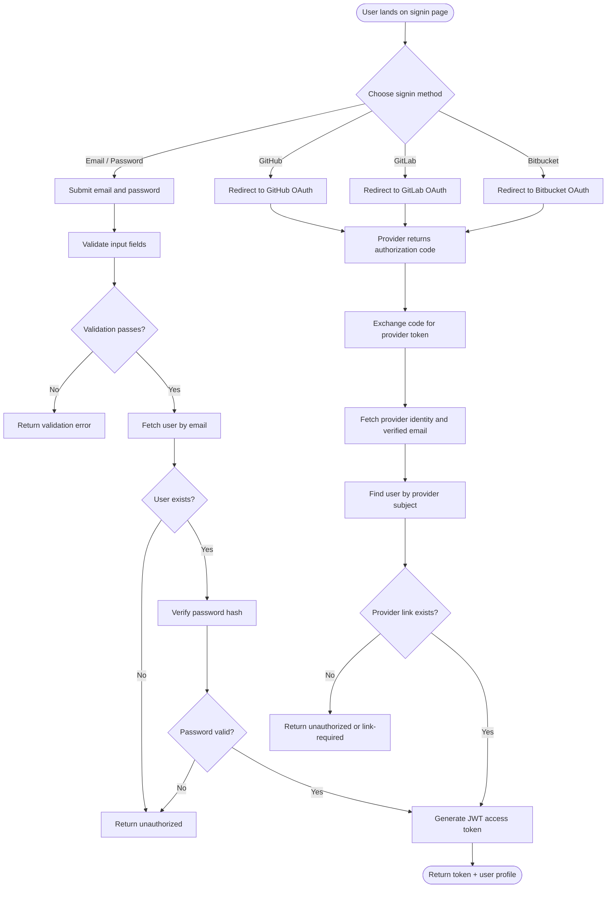

# Use-Case: Signin

## Actor
**User** — a registered OSSN user who wants to access their account.

## Goal
Authenticate an existing user using local credentials or an OAuth provider, then return an access token and user profile.

## Preconditions
- The user already has an account in OSSN.
- For local signin, the user knows their email and password.
- For OAuth signin, the user can authenticate with GitHub, GitLab, or Bitbucket.

## Supported Login Methods
| Method | Authentication mechanism |
|---|---|
| Email/Password | Credential verification against stored password hash |
| GitHub | OAuth 2.0 authorization code flow |
| GitLab | OAuth 2.0 authorization code flow |
| Bitbucket | OAuth 2.0 authorization code flow |

## Main Flow

## Related Documents
- [Signin Decision Table](design-table.md)
- [Signin Sequence Diagram](sequence-diagram.md)
