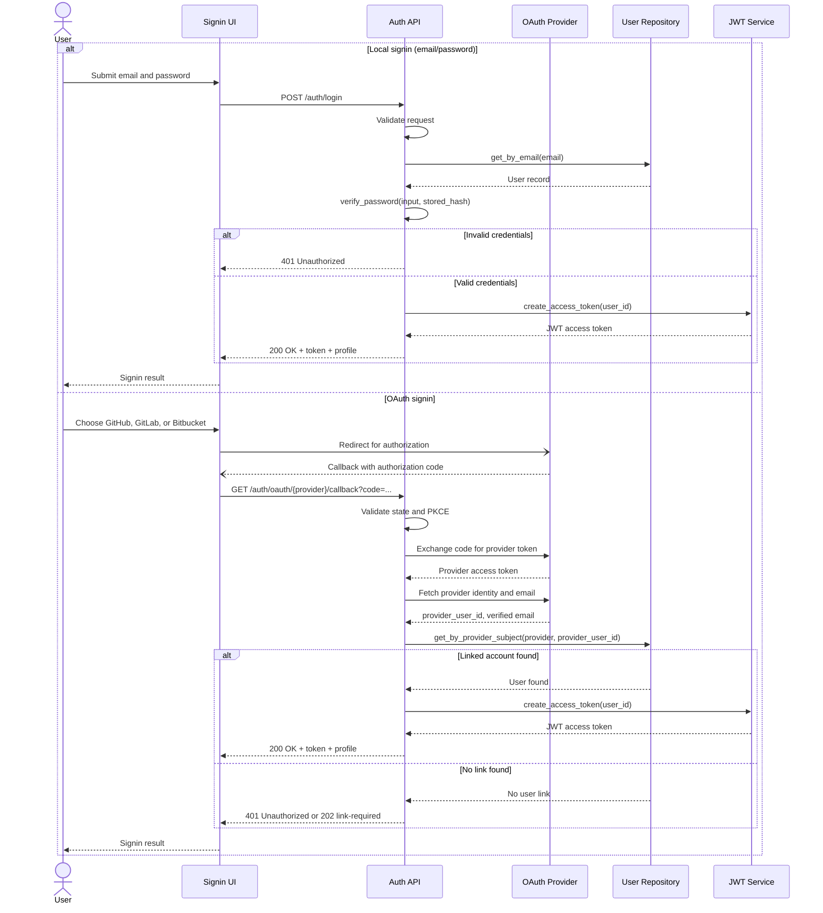

# Signin Sequence Diagram

## Purpose
Provide a concise interaction view of signin behavior for both local credentials and OAuth providers.

## Mermaid Sequence Diagram

## Related Documents
- [Signin Use-Case](README.md)
- [Signin Decision Table](design-table.md)
