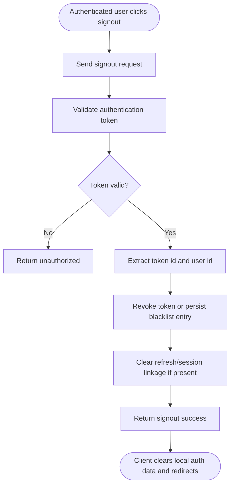

# Use-Case: Signout

## Actor
**Authenticated User** — a signed-in OSSN user who wants to end their active session.

## Goal
Invalidate the current authentication context so the user is logged out and must authenticate again to access protected resources.

## Preconditions
- The user is currently authenticated with a valid access token.
- The signout request includes the active token (or session identifier).
- Token/session revocation strategy is configured (blacklist, rotation tracking, or session store).

## Supported Signout Methods
| Method | Signout mechanism |
|---|---|
| Access token signout | Revoke or blacklist current JWT/session and clear client auth state |
| Provider signout (optional) | End local OSSN session; provider session termination is outside OSSN boundary |

## Main Flow

## Related Documents
- [Signout Decision Table](decision-table.md)
- [Signout Sequence Diagram](sequence-diagram.md)
