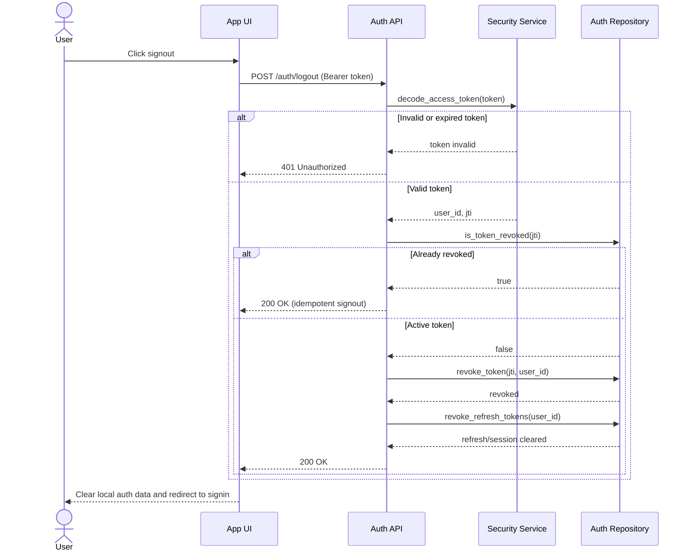

# Signout Sequence Diagram

## Purpose
Describe the interaction steps required to terminate an authenticated OSSN session safely and predictably.

## Mermaid Sequence Diagram

## Related Documents
- [Signout Use-Case](README.md)
- [Signout Decision Table](decision-table.md)
