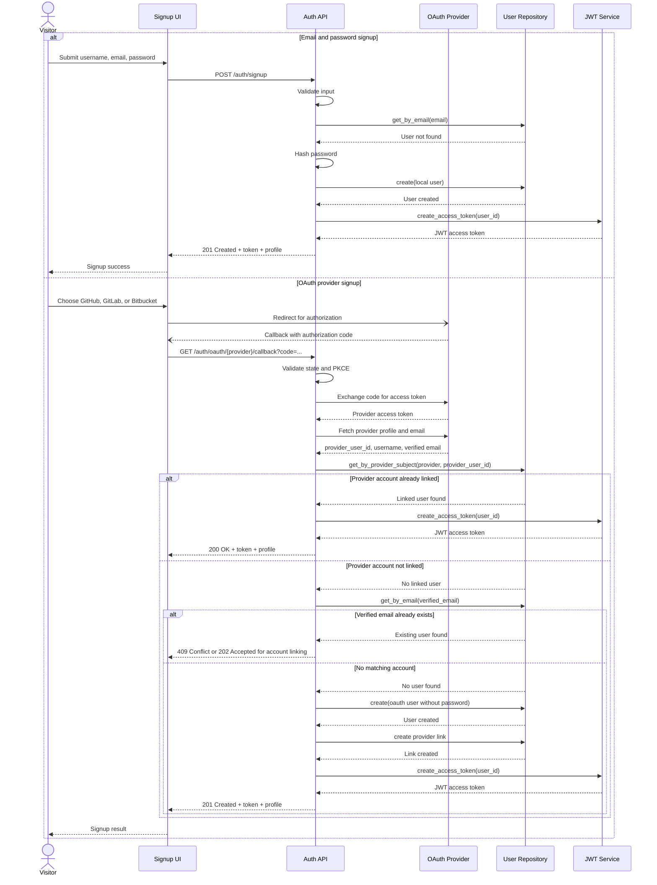

# Signup Sequence Diagram

## Purpose
Provide a focused sequence view of the signup flow for both local credentials and OAuth providers.

## Mermaid Sequence Diagram

## Related Documents
- [Signup Use-Case](README.md)
- [Signup Decision Table](decision-table.md)