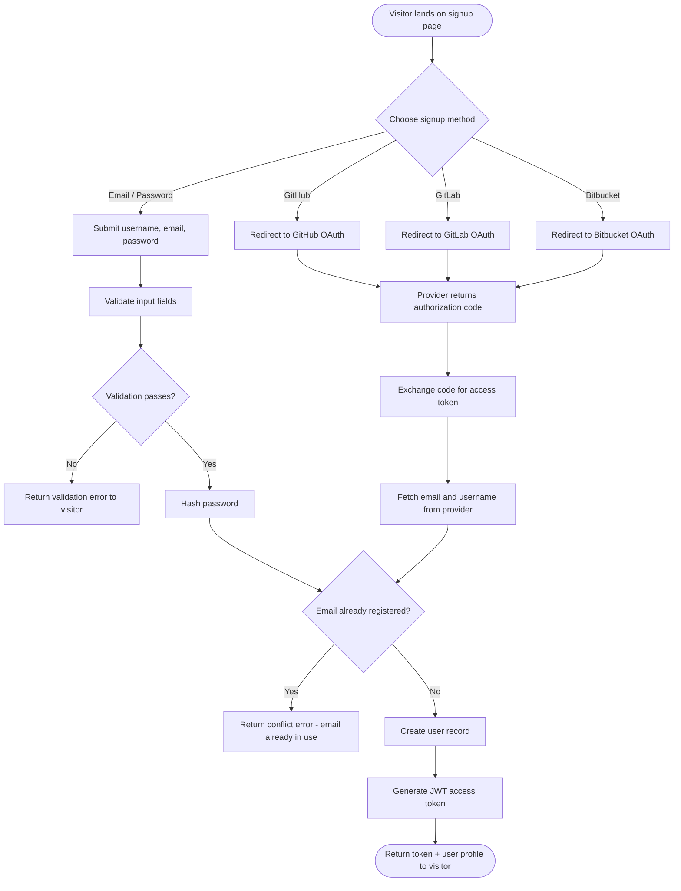

# Use-Case: Signup

## Actor
**Visitor** — an unauthenticated user who wants to create an account on OSSN.

## Goal
Allow a visitor to register an account using one of four supported methods, then grant them access to the application.

## Preconditions
- The visitor does not already have an account with the same email address.
- For OAuth providers (GitHub, GitLab, Bitbucket), the visitor has an existing account with that provider.

## Supported Registration Methods
| Method     | How credentials are collected            |
|------------|------------------------------------------|
| Email/Password | Visitor fills in a registration form |
| GitHub     | OAuth 2.0 authorization code flow        |
| GitLab     | OAuth 2.0 authorization code flow        |
| Bitbucket  | OAuth 2.0 authorization code flow        |

## Main Flow



## Alternative Flows

| Scenario | Outcome |
|---|---|
| Validation fails (missing field, bad email format, short password) | Return `422 Unprocessable Entity` with field-level errors |
| Email already exists (any method) | Return `409 Conflict` |
| OAuth provider denies access or user cancels | Return `401 Unauthorized` |
| OAuth provider returns no email (e.g. private GitHub email) | Return `422 Unprocessable Entity` — email required |
| Provider API call fails | Return `502 Bad Gateway` |

## Business Rules
- Passwords must be hashed before storage; plain-text passwords are never persisted.
- A user registered via OAuth has no password stored.
- Email is always the unique identifier, regardless of signup method.
- If a visitor tries to sign up via OAuth with an email that exists under a different method, return a conflict error with a hint to use their original signup method.

## Expected Output (Success)
```json
{
  "access_token": "<JWT>",
  "token_type": "bearer",
  "user": {
    "id": 1,
    "username": "alice",
    "email": "alice@example.com"
  }
}
```

## Service Mapping
| Step | Service Method |
|---|---|
| Hash password | `SecurityService.hash_password(password)` |
| Check email uniqueness | `UserRepository.get_by_email(email)` |
| Create user | `UserRepository.create(user_data)` |
| Exchange OAuth code | `OAuthService.exchange_code(provider, code)` |
| Fetch provider profile | `OAuthService.get_profile(provider, token)` |
| Generate JWT | `SecurityService.create_access_token(user_id)` |

## API Endpoint
| Method | Path | Request Body |
|---|---|---|
| `POST` | `/auth/signup` | `{ username, email, password }` |
| `GET` | `/auth/oauth/{provider}` | — (redirect to provider) |
| `GET` | `/auth/oauth/{provider}/callback` | `?code=...` (provider redirect) |

